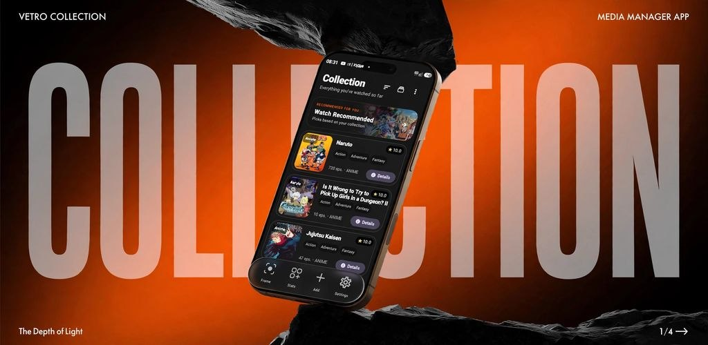
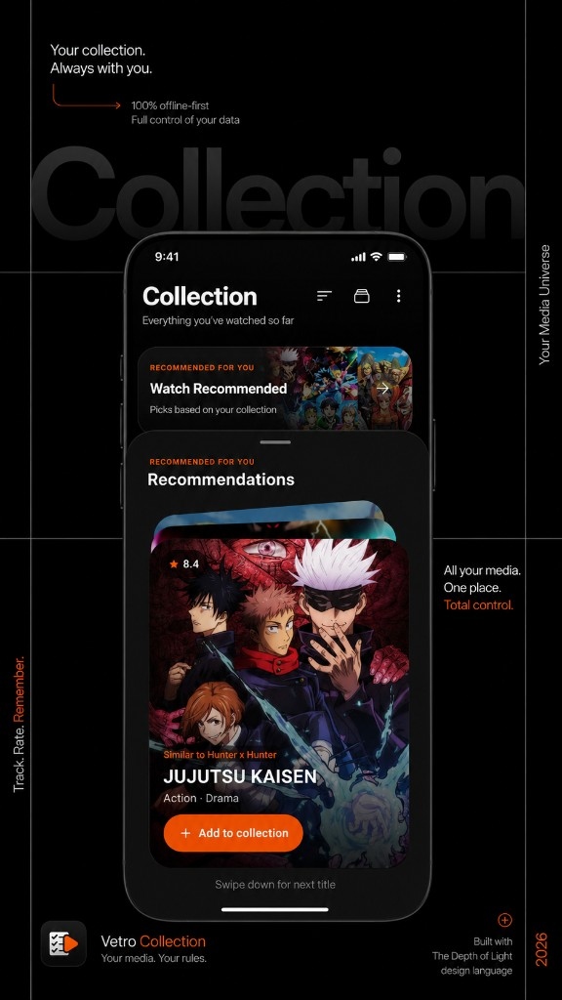
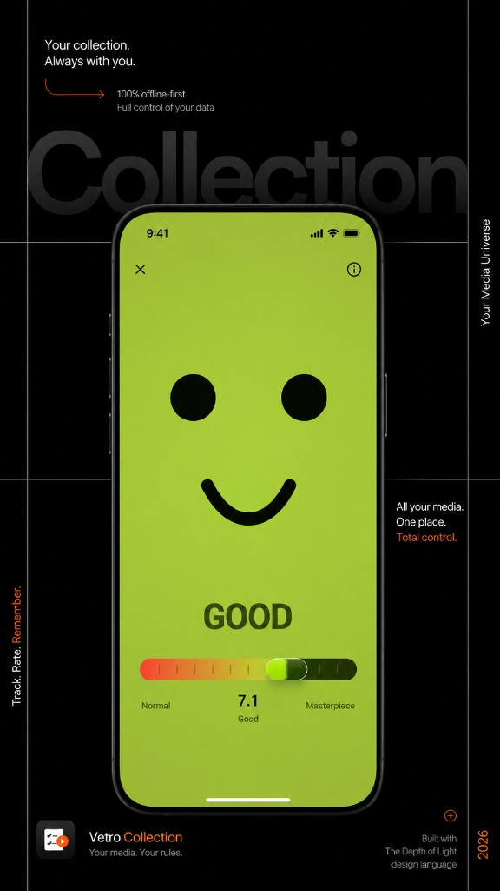
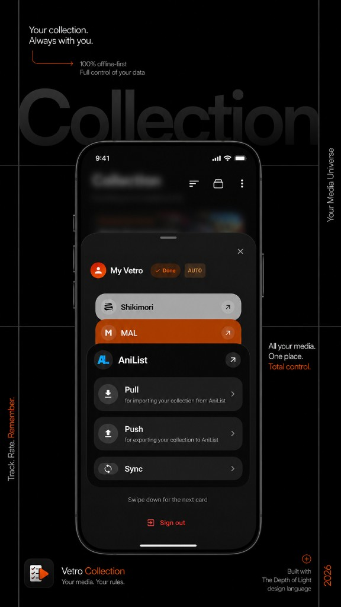
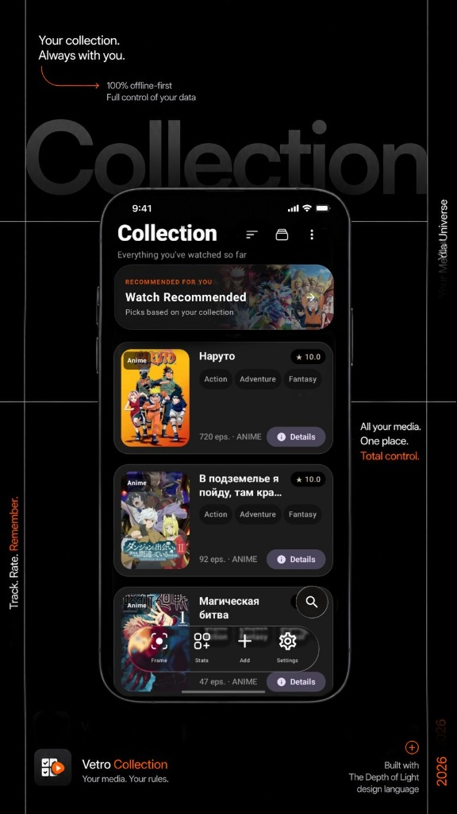
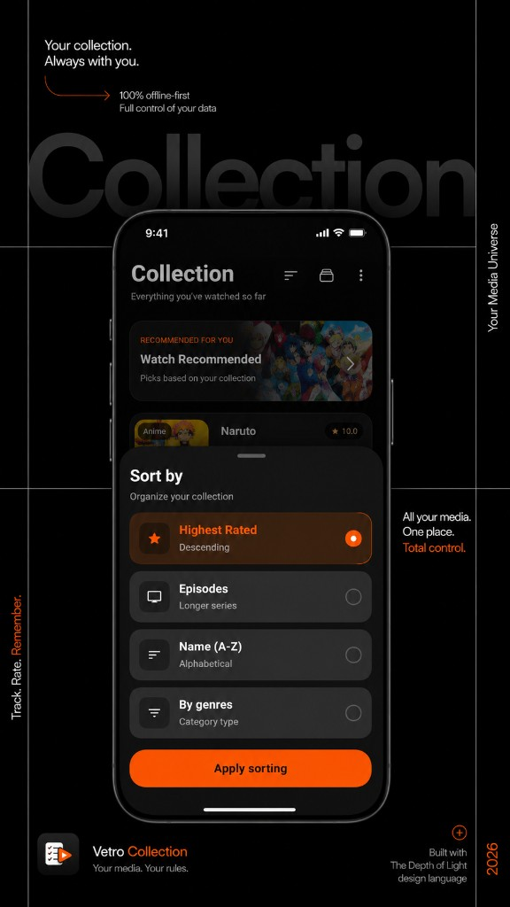

# Vetro

<p align="center">
  
</p>

<p align="center">
  <strong>One place to collect, watch, read and remember the stories you love.</strong><br />
  Anime · Manga · Manhwa · Movies · TV series
</p>

<p align="center">
  <a href="https://github.com/Phnem/Vetro-Collection/releases">Releases</a> ·
  <a href="LICENSE">MIT License</a> ·
  <a href="PRIVACY.MD">Privacy</a>
</p>

Vetro is an Android media library with a local-first core. Build a personal collection, discover titles, track progress, then watch episodes or read chapters without leaving the app. An account and cloud features are optional: the collection remains useful offline.

> **Current development build:** `V3.3.4-Beta`. It is actively evolving; source availability and individual media providers can vary by region.

## What Vetro does now

### Your collection

- Keep anime, manga, manhwa, films and series in one library.
- Search locally or add titles with metadata, cover art, genres and a 0.0–10.0 score.
- Track favourites, notes, comments, watched episodes and reading progress.
- Filter and sort the library by media type and other collection properties.
- Get collection statistics and tailored recommendations.

### Watch and download

- Open episode lists from a title’s details screen and choose among available sources.
- Stream with the built-in player, including picture-in-picture, episode navigation and optional auto-next / auto-skip behaviour.
- Download individual episodes or a season for offline playback; Vetro supports resilient HLS downloads and shows job progress.
- Open videos already stored on the device by selecting a dedicated title folder.

### Read manga and manhwa

- Discover chapters from supported manga sources and download chapters for offline reading.
- Read in a vertical webtoon layout or a paged layout, with configurable page direction.
- Reading position and layout preference are remembered per title.

### Make the library yours

- Light and dark themes, English and Russian interface languages, expressive motion and glass-inspired surfaces.
- Optional cloud account and backup/restore tools; local data is never contingent on signing in.
- Optional Bring Your Own Key (BYOK) connection for AI-assisted features.
- Import/export utilities, a shareable PDF collection export, database maintenance and diagnostics in Developer Settings.

## Screens

<p align="center">
  
  
</p>
<p align="center">
  
  
</p>
<p align="center">
  
</p>

## Install

Choose the distribution channel you prefer:

<p align="center">
  <a href="https://github-store.org/app?repo=Phnem/Vetro-Collection"></a>
  <a href="https://f-droid.org/packages/com.phnem.vetro"></a>
  <a href="obtainium://app/add?url=https://github.com/Phnem/Vetro-Collection"></a>
</p>

## Build from source

Requirements:

- Android Studio with JDK 21
- Android SDK 36
- An Android device or emulator running Android 8.0 (API 26) or newer

```bash
git clone https://github.com/Phnem/Vetro-Collection.git
cd Vetro-Collection
./gradlew assembleDebug
```

On Windows, use `gradlew.bat assembleDebug`. The debug APK is written to `app/build/outputs/apk/debug/`.

### Optional service configuration

Copy `local.properties.example` to `local.properties` and fill only the integrations you intend to use. OAuth and Supabase values are read from environment variables first, then from `local.properties`; empty values leave the related functionality unavailable. Never commit this file or API keys.

## Architecture

Vetro is a Kotlin and Jetpack Compose Android application organized around a unidirectional state flow and modular data/domain/UI layers.

- **UI:** Jetpack Compose, Navigation Compose, Material 3 and custom design-system components.
- **State and DI:** immutable UI state, Kotlin Flow, ViewModels and Koin.
- **Data:** SQLDelight-backed local storage, preferences and WorkManager for long-running downloads.
- **Network:** Ktor, Apollo GraphQL and provider-specific media/source adapters.
- **Playback:** AndroidX Media3 / ExoPlayer for streaming and local playback.

## Privacy

Vetro is local-first. It does not require an account to manage a collection. Network requests occur when you use online search, media sources, sync/backup, updates or an optional AI provider. See [PRIVACY.MD](PRIVACY.MD) for the project privacy policy.

## Contributing

Issues and pull requests are welcome. Before proposing a change, please check the existing architecture and keep secrets, build output and personal `local.properties` files out of commits.

## License

Vetro is released under the [MIT License](LICENSE).
