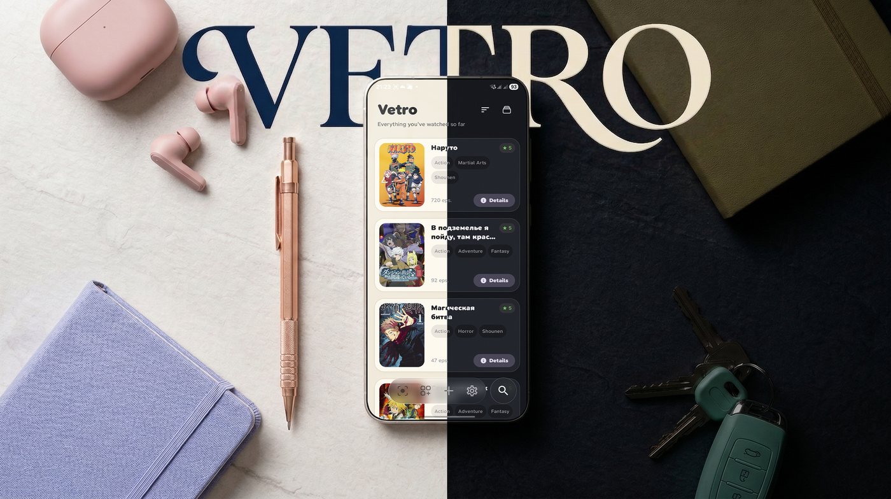
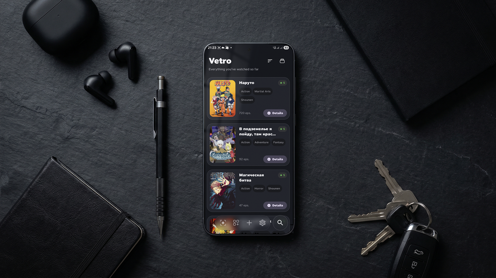
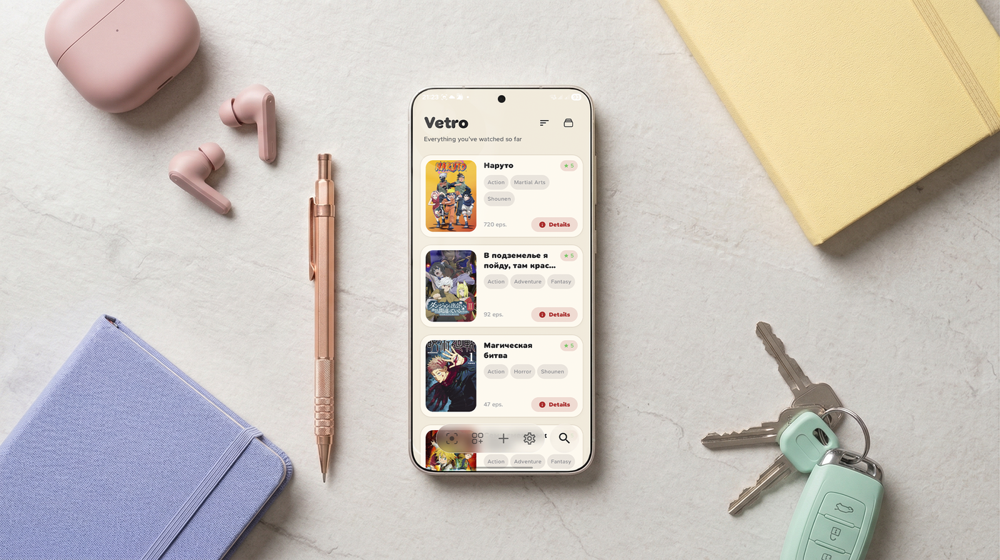

<h1 align="center">Vetro Collection 🎬📚</h1>

  

  

  <b>Offline-first universal media collection manager built on The Depth of Light design language.</b> 
  Experimental multi-media architecture introducing Anime, Manga, TV Shows and future media types under one unified collection.

  Kotlin · Compose · SQLDelight · Ktor · Koin · Supabase · Apollo · kyant0 Blur

---

<h2 align="center">✨ What is Vetro Collection?</h2>

Vetro Collection is a modern <b>offline-first media collection manager</b> focused on performance, privacy and long-term scalability.

Originally created as an anime tracker, the project is now evolving into a universal collection platform capable of managing multiple media types while preserving a clean, reactive architecture.

Current supported media:

- 🎬 Anime
- 📖 Manga *(Experimental)*
- 📺 TV Shows

Future-ready architecture allows additional media categories without major migrations.

---

<h2 align="center">🚀 Join the Community</h2>

  

Get beta announcements, development updates, screenshots and release previews.

---

<h2 align="center">📸 Screenshots</h2>

  
  

  <i>Click any image to view full resolution</i>

---

<h2>🧠 Core Philosophy</h2>

- Offline-first
- No mandatory accounts
- Your data belongs to you
- Cloud is optional
- Reactive UI everywhere
- Deterministic state management
- Modern Android architecture
- Privacy by default

---

<h2>✨ Features</h2>

<h3>📚 Universal Media Collections</h3>

- Anime
- TV Shows
- **Manga (Experimental)**
- Favorites
- Ratings
- Notes & comments
- Reactive collection updates

<h3>🔍 Advanced Search</h3>

- Instant SQL search
- API search
- Image recognition
- Metadata auto-fill
- Smart debounce
- Media source filters

<h4>🧠 Image Recognition</h4>

- Screenshot recognition
- trace.moe integration
- AI movie recognition
- One-click import

<h3>📦 Collection Management</h3>

- Unified collection
- Custom sorting
- Smart filtering
- Media badges
- Quick media switcher
- Import / Export

<h3>👉 Gestures</h3>

- Swipe to delete
- Swipe to favorite
- Haptic feedback

  

---

<h2>🆕 New in v3.2.8 Beta</h2>

<h3>📖 Experimental Manga Support</h3>

This release marks the beginning of Vetro Collection's evolution into a universal media manager.

Added experimental support for:

- Manga
- Manhwa
- Other printed media

This feature is still under active development.

---

<h3>🗄 Independent Database Architecture</h3>

To safely support multiple media types:

- Separate SQLDelight databases
- Anime collections remain isolated
- Zero migration risk
- Safer upgrades

Internally multiple databases are merged into one reactive collection using Kotlin Flow.

Users simply see one library.

---

<h3>⚙️ Database Improvements</h3>

- SQL filtering moved into database
- SQL sorting optimization
- Flow combine() pipeline
- distinctUntilChanged()
- Lower CPU usage
- Faster rendering
- Better scrolling performance

---

<h3>🔐 Supabase Authentication</h3>

Added Supabase cloud authentication with optional sync.

Supported providers:

- Google *(OAuth via Custom Tabs)*
- GitHub
- Email + Password
- Guest mode

Also added:

- Account management screen
- Authentication status
- Linked account management
- Cloud restore with sync status indicator

Removed:

- Magic Link authentication
- Dropbox sync *(replaced by Supabase + R2)*

---

<h3>🌐 Better Content Pipeline</h3>

Primary providers:

- AniList
- Shikimori

Automatic fallback:

- Jikan API

Provides significantly higher reliability when external services become unavailable.

---

<h3>🎨 Search Redesign</h3>

Completely redesigned search interface.

New features:

- Search capsules
- Anime / Manga / TV filters
- Media badges
- 250–300 ms debounce
- Faster SQL queries

---

<h3>⚡ Adaptive Blur Rendering</h3>

Introduced intelligent blur optimization.

While scrolling quickly:

- expensive blur is disabled

When scrolling stops:

- blur smoothly returns

Result:

- dramatically smoother scrolling
- fewer frame drops
- lower GPU load

---

<h3>🔄 Synchronization</h3>

Improved:

- Sync workflow
- Status tracking
- Dynamic sync badge
- Cover image restore after reinstall

Developer recovery utility added:

Developer Settings → Repair Database

Repairs:

- Genres
- Covers
- Metadata
- Synchronization artifacts

---

<h3>⬆️ Smart Update System</h3>

Separate update channels:

- GitHub *(optional, off by default in Developer Settings)*
- F-Droid

GitHub releases include:

- Built-in changelog
- Native updater
- Smart installation flow

F-Droid builds use the store update flow instead of GitHub API checks.

---

<h3>🌍 Localization</h3>

- Massive English/Russian cleanup
- Removed remaining hardcoded strings
- Unified translations
- Better language consistency
- Welcome screen follows system locale

---

<h3>🎨 UI Improvements</h3>

- Redesigned search
- New media badges
- New filter dropdown
- Better navigation
- Improved animations
- Updated Depth of Light components

---

<h2>🧪 Previous 3.2.x Highlights</h2>

- Depth of Light visual language
- New kyant0 blur renderer
- Redesigned light theme
- Adaptive launcher icons
- Scoped Storage migration
- Built-in updater
- AniList integration
- Shikimori integration
- PDF export
- Visual Search
- Digital Sarcasm System (600+ contextual phrases)
- Developer Settings
- Numeric notification badges

---

<h2>🏗 Architecture</h2>

<h3>Clean Architecture</h3>

- UI / Domain / Data separation
- UseCases
- DTO layer
- Domain-driven structure

<h3>State Management</h3>

- Strict UDF
- Immutable UI State
- Channel SideEffects
- Reactive Compose architecture

<h3>Reactive Data Layer</h3>

- SQLDelight
- Kotlin Flow
- Multi-database merge
- Single UI source of truth

<h3>Dependency Injection</h3>

- Koin 4.x
- Fully modular graph

<h3>Networking</h3>

- Ktor
- Apollo GraphQL
- Supabase SDK

---

<h2>⚡ Performance</h2>

Major optimizations include:

- SQL-side filtering
- SQL-side sorting
- Adaptive blur rendering
- Reduced recompositions
- Optimized Coil loading
- Better CPU utilization
- Faster startup
- Lower memory usage
- Improved LazyColumn rendering
- Faster synchronization checks

Result:

- Instant search
- Smooth scrolling
- Stable rendering
- Better battery efficiency

---

<h2>☁️ Sync & Integrations</h2>

Supported services:

- Supabase Cloud
- AniList
- Shikimori

Capabilities:

- Cloud backup
- Restore
- Collection import
- Cross-device synchronization
- External library migration

---

<h2>🔐 Privacy</h2>

- Offline-first
- No analytics
- No tracking
- No hidden background requests
- Cloud remains optional
- F-Droid-friendly build *(no proprietary Google Sign-In SDK)*

---

  

---

<h2>📄 License</h2>

Licensed under the <b>MIT License</b>.

See the <a href="LICENSE">LICENSE</a> file for details.
